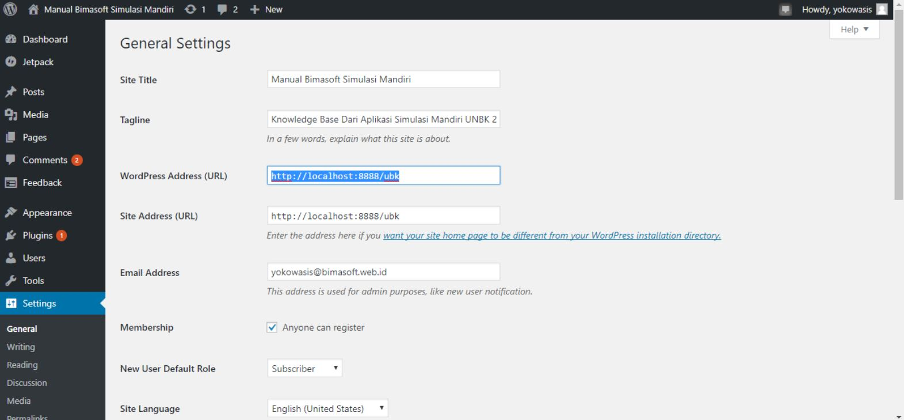

# Mengganti IP

## Melalui wp-admin
1. Login ke wp-admin
2. Masuk ke menu wp-admin > settings > general
3. Ganti Wordpress (URL) dan Site Address (URL)

## Melalui phpmyadmin
1. Masuk ke phpmyadmin
    - Auto Installer : [http://localhost:8888/phpmyadmin](http://localhost:8888/phpmyadmin)
    - VHD : [http://192.168.0.201/phpMyAdmin](http://192.168.0.201/phpMyAdmin) (Huruf Besar Kecil Pengaruh)
2. Pilih Database UNBK (Sebelah Kiri)
3. Pilih wp_options
4. Ganti *siteurl* dan *home*

