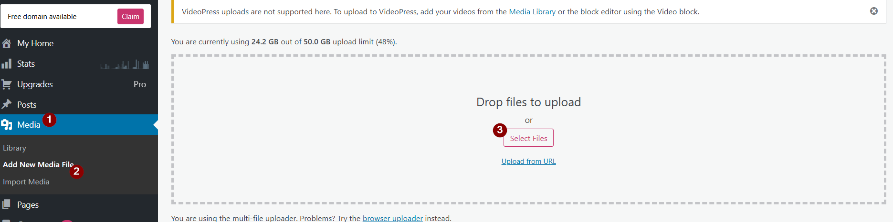
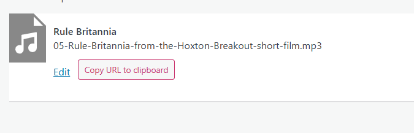

# Soal Listening

Untuk menambahkan listening yang perlu dilakukan pertama kali adalah mengupload file mp3 ke dalam media di wp-admin.



Copy URL



Masukkan code berikut ke dalam soal

```
[bimasoft_embed link=<audio controls><source src="TARUH URL YANG DI COPY KE SINI" type="audio/mpeg" />Browser Tidak Di support</audio>]
```

Ganti `TARUH URL YANG DI COPY KE SINI` dengan URL yang sudah di copy tadi. Jangan mengganti yang lain. Microsoft word terkadang mengganti tanda kutip yang semula " menjadi “ dan ”. Jadi pastikan tanda kutip yang digunakan adalah tanda kutip yang benar (").
