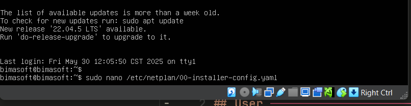

# Mengganti IP

## Melalui wp-admin

1. Login ke wp-admin
2. Masuk ke menu wp-admin > settings > general
3. Ganti Wordpress (URL) dan Site Address (URL)
   

## Melalui phpmyadmin

1. Masuk ke phpmyadmin
   - Auto Installer : [http://localhost:8888/phpmyadmin](http://localhost:8888/phpmyadmin)
   - VHD : [http://192.168.0.201/phpMyAdmin](http://192.168.0.201/phpMyAdmin) (Huruf Besar Kecil Pengaruh)
2. Pilih Database UNBK (Sebelah Kiri)
3. Pilih wp_options
4. Ganti _siteurl_ dan _home_
   

## Mengganti IP VHD

1. Masuk ke Dalam VHD

- Buka Virtualbox


- Masukkan username: `bimasoft`, password : `123123`


untuk password tidak terlihat, dan ini normal. Tekan Enter setelah mengetik password.

2. Tulis perintah berikut di terminal

```bash
sudo nano /etc/netplan/00-installer-config.yaml
```



apabila diminta password, masukkan password `123123`. Perintah ini akan membuka file konfigurasi jaringan.

3. Silakan rubah isi file yang sudah ada, dan ganti IP Address sesuai dengan yang diinginkan, tidak perlu merubah yang lain. Contoh:

```yaml
network:
  ethernets:
    enp0s3:
      addresses:
        - 192.168.1.201/16 <-- rubah yang ini
      nameservers:
        addresses: []
        search: []
    enp0s8:
      dhcp4: true
  version: 2
```


Untuk subnet mask sesuaikan dengan tabel berikut:

| Subnet Mask   | Notasi CIDR | Maximal Jumlah Client |
| ------------- | ----------- | --------------------- |
| 255.255.255.0 | /24         | 256                   |
| 255.255.252.0 | /22         | 1024                  |
| 255.255.248.0 | /21         | 2048                  |
| 255.255.0.0   | /16         | 65536                 |

Keluar menggunakan `CTRL + X`, lalu tekan `Y` untuk menyimpan perubahan, dan tekan `Enter`.

> Device client harus mengikuti subnet mask yang sama dengan VHD. Misalnya, jika subnet mask VHD nya adalah `/22`, maka subnetmask client juga harus `/22` atau `255.255.252.0`.

4. Terapkan perubahan dengan perintah berikut:

```bash
sudo netplan apply
```
