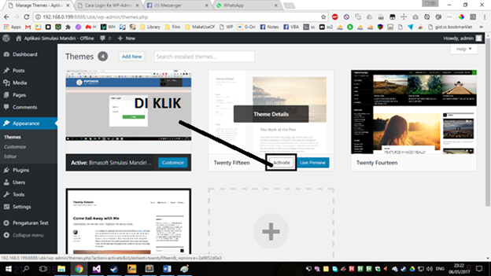
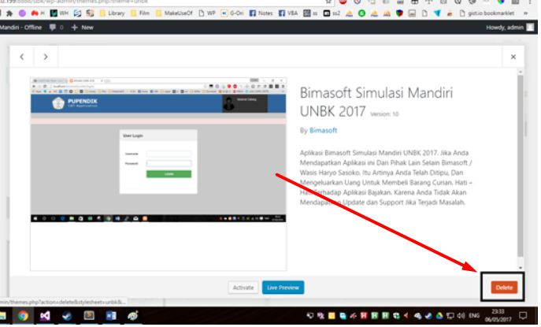
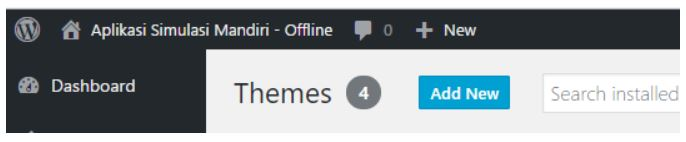
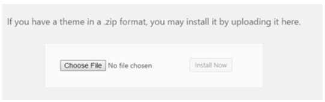

# Tata Cara Update

Setiap client berhak menerima update selama masa kontrak aktif. Update bisa dilakukan dengan cara 

1. Login ke `wp-admin` 
2. Masuk ke menu `Appearance > Themes`
3. Aktifkan tema wordpres lainnya selain tema Bimasoft / Bisa di lompat jika tema yg lain sudah aktif.

4. Klik Tema Bimasoft
5. Pilih `Delete`

6. Add New

7. Upload Theme

8. Choose File

9. Pilih `unbk7.zip` (Download melalui [https://client.bimasoft.web.id](https://client.bimasoft.web.id) dan di *Extract*)
10. Activate
11. Lakukan *Save Pengaturan Test* dan *Reset Database*