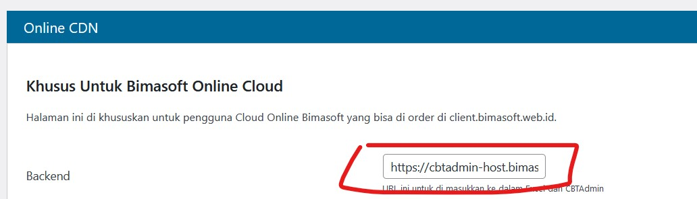
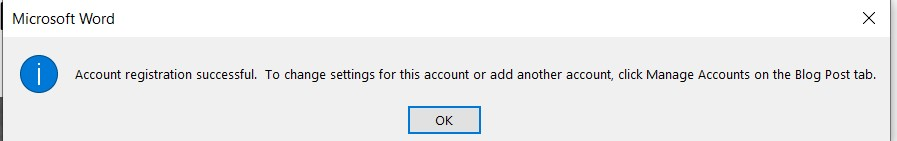

# Quick Start

## Persiapan Alat dan Bahan
1. Download Template Word dan Excel melalui [Google Drive](https://bimasoft.web.id/gdrive/)
2. Catat Link - Link Penting
    - URL Word 
    
    - URL Server Excel (Ambil di `wp-admin > Online CDN > backend`)
    
    - URL Siswa
    - Username / Password `wp-admin`

## Pembuatan Soal
1. Buka `Template Word`
2. Pilih `Manage Account`
3. Pilih [!button variant="secondary" text="New"]
4. Ganti `Blog` dari `Choose your blog provider` menjadi `Wordpress`, [!button variant="secondary" text="Next"]
5. Isi sesuai data yg di catat pada point sebelumnya

Nama Kolom          | Isian
--------------------|------------------------
Blog Post Url       | `URL Word`
Username            | username `wp-admin`
Password            | password `wp-admin`
Remember Password   | ✅

Klik [!button variant="secondary" text="OK"]

*Konfirmasi Berhasil*

Klik [!button variant="secondary" text="OK"], Klik [!button variant="secondary" text="Close"]

6. Buat soal sesuai template yg disediakan. Ganti Kode Test (Judul Soal, Paling atas)
7. Publish

## Input Kunci Jawaban dan Data Siswa

### Kunci Jawaban

1. Buka `Template Excel`
2. Isi Sesuai Petunjuk di bawah ini

Nama Kolom              | Isian                                     | Contoh 
------------------------|-------------------------------------------|---------------------------
Server                  | URL Server Excel di atas                  | https://cbt-dst-nya.com/
Kode Test               | Kode Test yang diisi di `Word`            | IPA
Nama Test               | Bebas                                     | IPA
Status                  | Bebas                                     | PAS
Sub Test                | Bebas                                     | PAS
Tanggal                 | Tanggal Test                              | 12-02-2022
Waktu Test              | Waktu Test                                | 07:30
Alokasi                 | Durasi Test (dalam menit)                 | 90
Jumlah Soal             | Sesuai Jumlah soal di `Word`              | 30
Yang Harus Dikerjakan   | Jumlah soal wajib yg di kerjakan siswa    | 30 
Acak Soal / Option      | Apakah soal / option mau di acak ?        | 1 / 1

3. Isi Kunci Jawaban dan Skor Pada Kolom di Sebelah Kanan, Semua No. Soal wajib memiliki kunci. Jika ada Soal yang kelebihan, maka hapus soal tersebut.
4. Klik Tombol [!button variant="secondary" text="Save"] di sebelah Kanan

### Data Siswa
1. Klik `Sheet Peserta`
2. Isi Biodata
    - Server wajib huruf besar semua tanpa spasi
    - Sesi wajib angka
3. Klik Tombol [!button variant="secondary" text="Save"] di sebelah kanan

## Pelaksanaan Ujian
1. Buka `URL Siswa`
2. Pilih Mapel
3. Gunakan `username` dan `password` yang di input pada `Template Excel` di `Sheet Peserta` pada langkah [sebelumnya](#data-siswa)

## Penilaian / Hasil
1. Buka `Template Excel`
2. Klik `Sheet Hasil`
3. Klik Refresh Hasil Kiri Atas 🔃
