# Macam - macam bentuk soal

Untuk soal selain pilihan ganda bisa dibuat melalui tombol macro yang ada di bagian *Quick Access Toolbar* (kiri atas) pada *Microsoft Word* 

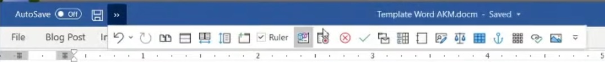

## Soal Pilihan Ganda

Soal | Kunci | Hasil
-----|-------|------
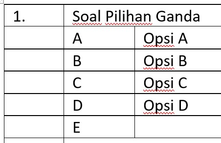 | 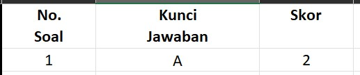 | 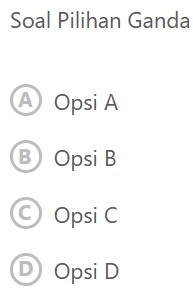

## Soal Benar / Salah

Soal | Kunci | Hasil
-----|-------|------
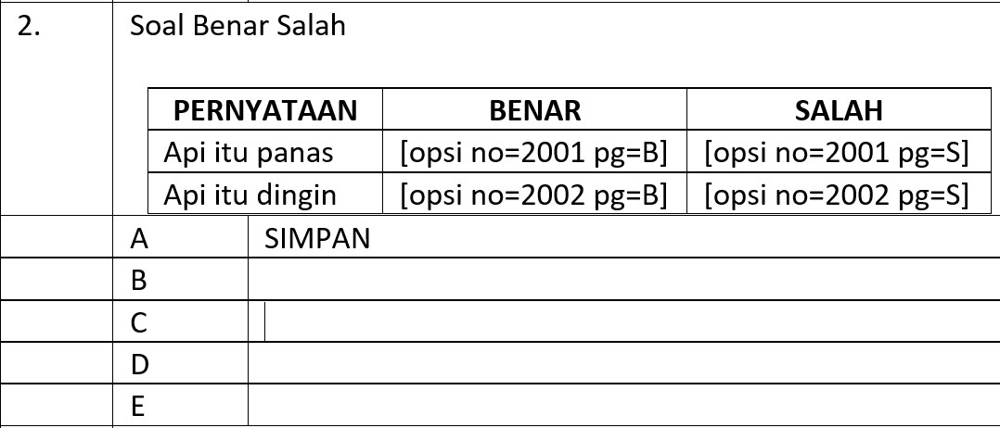 | 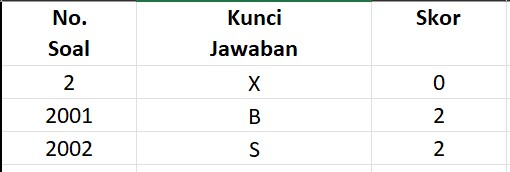 | 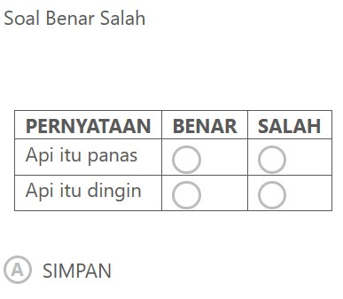

## Soal Penjodohan

Soal | Kunci | Hasil
-----|-------|------
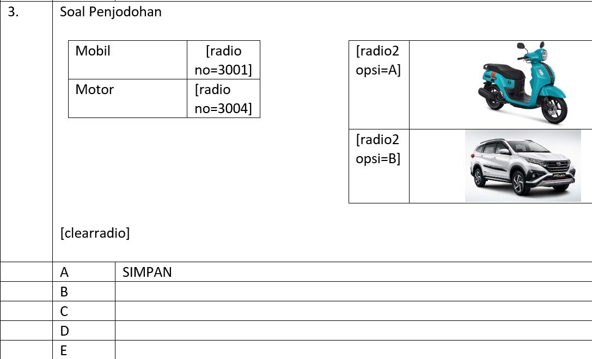 | 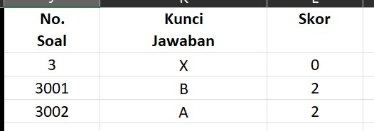 | 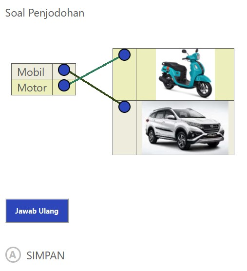

## Soal Pilihan Ganda Kompleks

Soal | Kunci | Hasil
-----|-------|------
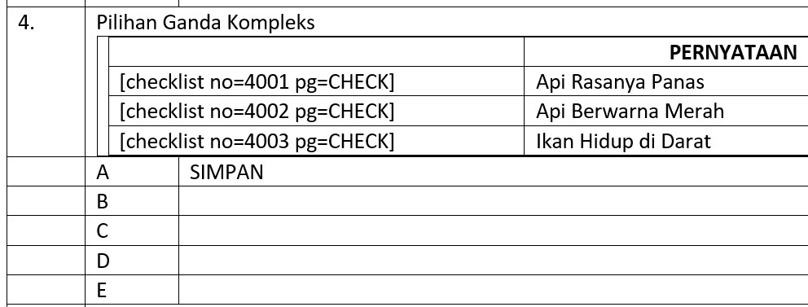 | 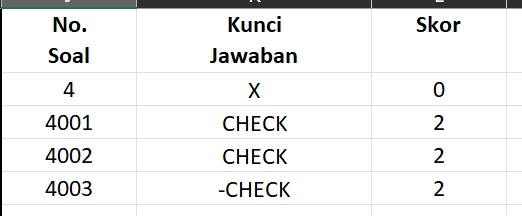 | 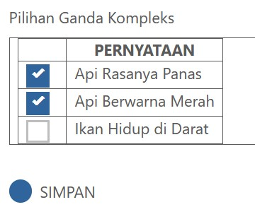

## Soal Isian / Uraian / Essay

Soal | Kunci | Hasil
-----|-------|------
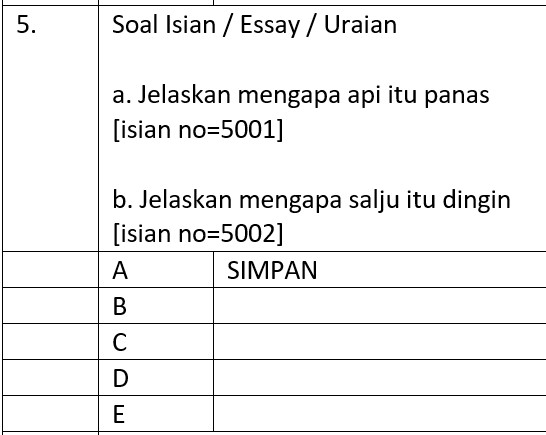 | 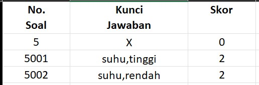 | 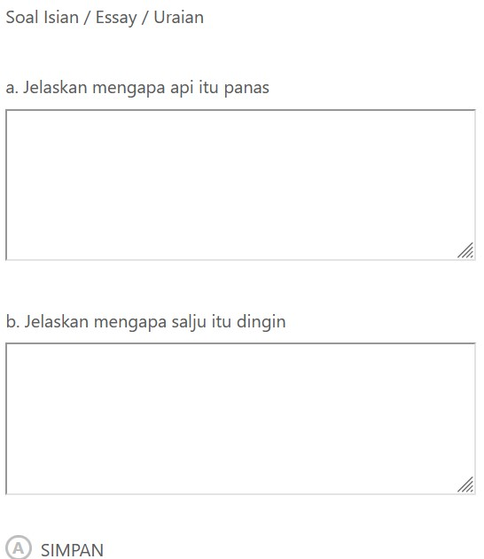

## Soal Isian Singkat

Soal | Kunci | Hasil
-----|-------|------
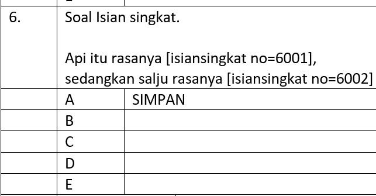 | 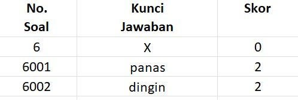 | 

## Soal List / Pilihan

Soal | Kunci | Hasil
-----|-------|------
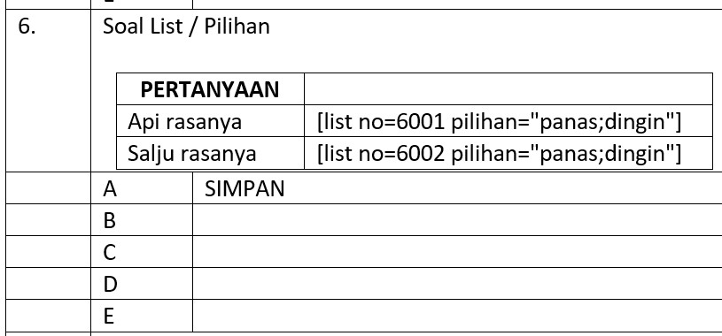 | 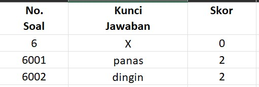 | 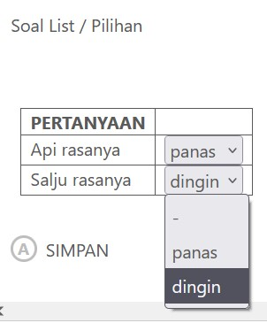

## Pilihan Ganda Berkolom

Soal | Kunci | Hasil
-----|-------|------
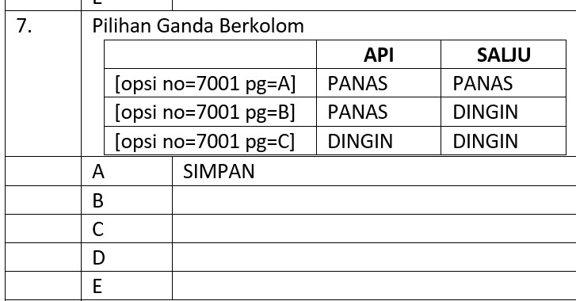 | 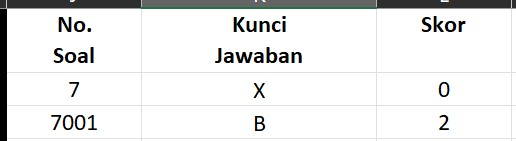 | 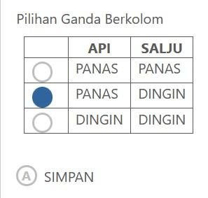

## Pilihan Ganda Berkolom

Soal | Kunci | Hasil
-----|-------|------
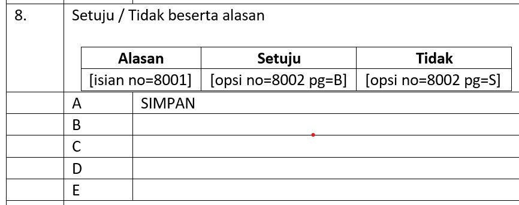 | 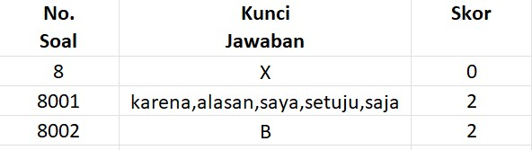 | 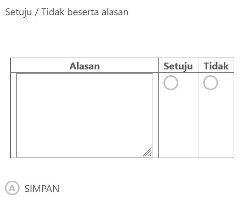

## Survey

Soal | Kunci | Hasil
-----|-------|------
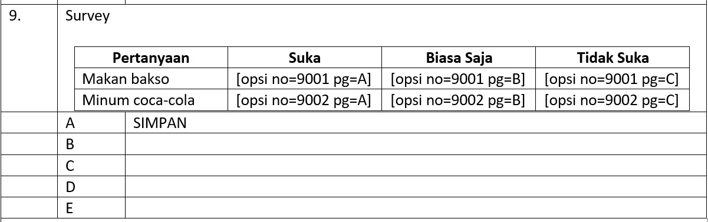 | 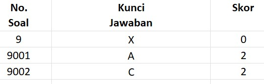 | 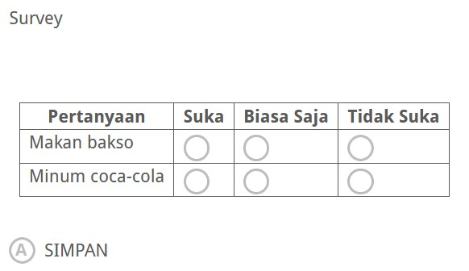

