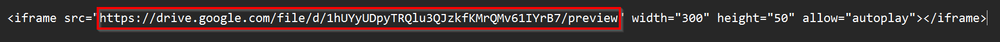

# Include Content Luar / Soal Embed


Bimasoft support memasukkan element dari tempat / website lain seperti [Youtube](https://youtube.com), [Soundcloud](https://soundcloud.com), [Google Drive](https://drive.google.com), [Google Form](https://form.google.com), dll.

Langkah - langkah :
1. Upload file ke dalam platform yang diinginkan
2. Pilih export 
3. Copy link export yang berbentuk embed (biasanya di awali tulisan iframe)
4. Klik tombol exmbed external content 

# Contoh Code Penulisan :

## Menggunakan `bimasoft_embed`

`bimasoft_embed` memerlukan 3 parameter, `link`, `w`, dan `h`. `w` dan `h` adalah parameter untuk ukuran dari player. `w=500px`, `h=60px` artinya player berukuran 500 x 60 pixel. Sedangkan `link` adalah parameter yg berisi link `src` dari iframe yang kita copy.




Berikut merupakan contoh penulisan menggunakan `bimasoft_embed`

### SoundCloud
```
[bimasoft_embed w=500px h=30px link=https://archive.org/embed/never-gonna-give-you-up_202211]
```

### Youtube
```
[bimasoft_embed w=300px h=300px link=https://www.youtube.com/embed/dQw4w9WgXcQ?si=X3vFz3UIgYc0hUL5]
```

### Google Drive

```
[bimasoft_embed w=500px h=50px link=https://drive.google.com/file/d/197kJKmVYZ8YHE6OmkoRYuzulVWswq_6J/preview]
```

## Menggunakan `embedcontent`

Untuk menggunakan `embedcontent`, kita cukup memasukkan code `iframe` yang kita copy ke dalam `embedcontent` secara utuh tanpa perlu di edit - edit lagi. Di awali dengan `<iframe`, dan diakhir dengan `</iframe>`

Berikut merupakan contoh penulisan menggunakan `embedcontent`

### SoundCloud

```
[embedcontent]<iframe width="100%" height="166" scrolling="no" frameborder="no" allow="autoplay" src="https://w.soundcloud.com/player/?url=https%3A//api.soundcloud.com/tracks/1242868615&color=%23ff5500&auto_play=false&hide_related=false&show_comments=true&show_user=true&show_reposts=false&show_teaser=true"></iframe>[/embedcontent]
```

### Youtube

```
[embedcontent]<iframe width="560" height="315" src="https://www.youtube.com/embed/dQw4w9WgXcQ?si=rP8sPiSxp4UtaKUS" title="YouTube video player" frameborder="0" allow="accelerometer; autoplay; clipboard-write; encrypted-media; gyroscope; picture-in-picture; web-share" referrerpolicy="strict-origin-when-cross-origin" allowfullscreen></iframe>[/embedcontent]
```

### Google Drive

```
[embedcontent]<iframe src="https://drive.google.com/file/d/197kJKmVYZ8YHE6OmkoRYuzulVWswq_6J/preview" width="640" height="480" allow="autoplay"></iframe>[/embedcontent]
```

Berikut adalah video untuk mengembed dari Google Drive, Youtube dan Soundcloud

[!embed](https://www.youtube.com/watch?v=vTDmMoSF224&feature=youtu.be)

