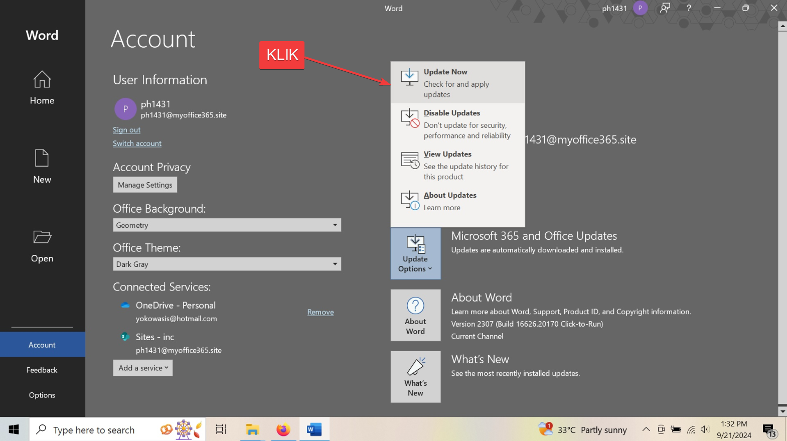

# Tombol Publish Disabled

## Tombol Publish Berwarna Abu - Abu, Manage Account tidak bisa di klik, atau Hilang

[!embed](https://youtube.com/watch?v=dfUyTILcgOE)

1. Download [Update](/downloads/update.zip)
2. Extract file yang di download
3. Klik kanan runasadmin.bat, run as administrator
   
4. Tunggu Beberapa Detik
5. Update Microsoft Word
   
6. Matikan update
   

## Alternatif lain

### Install ulang Microsoft Office versi ProPlus

| Office     | Link                                                                                                              |
| ---------- | ----------------------------------------------------------------------------------------------------------------- |
| Office 365 | [Link](https://officecdn.microsoft.com/db/492350f6-3a01-4f97-b9c0-c7c6ddf67d60/media/en-us/O365ProPlusRetail.img) |
| 2021       | [Link](https://officecdn.microsoft.com/db/492350f6-3a01-4f97-b9c0-c7c6ddf67d60/media/en-us/ProPlus2021Retail.img) |
| 2019       | [Link](https://officecdn.microsoft.com/db/492350f6-3a01-4f97-b9c0-c7c6ddf67d60/media/en-us/ProPlus2019Retail.img) |
| 2016       | [Link](https://officecdn.microsoft.com/db/492350f6-3a01-4f97-b9c0-c7c6ddf67d60/media/en-us/ProPlusRetail.img)     |
